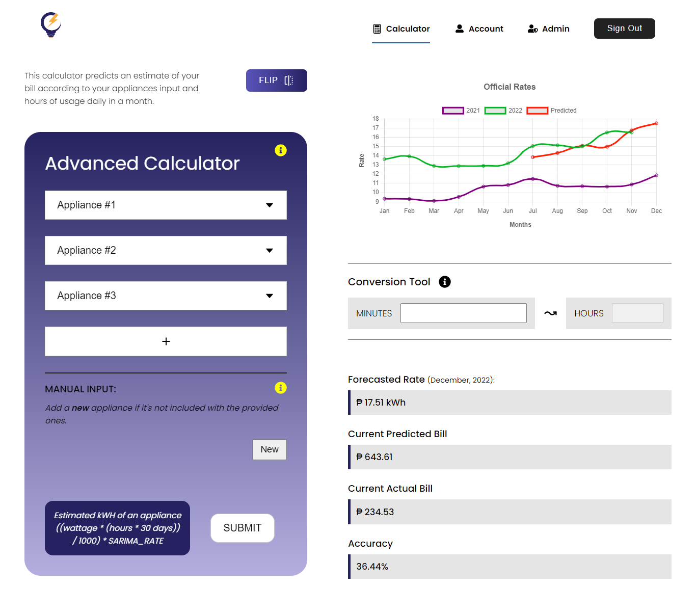
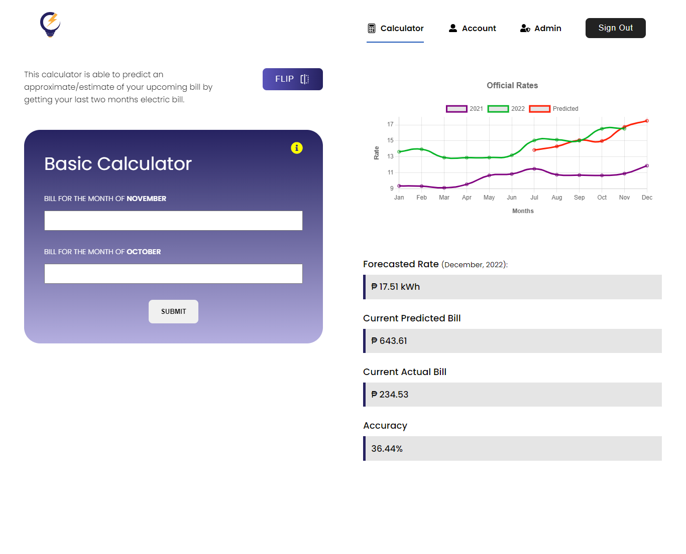
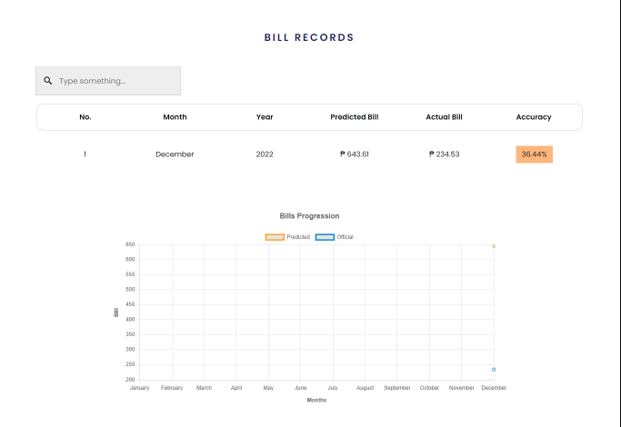
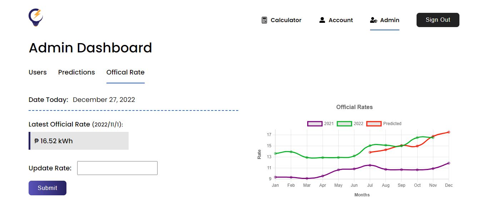
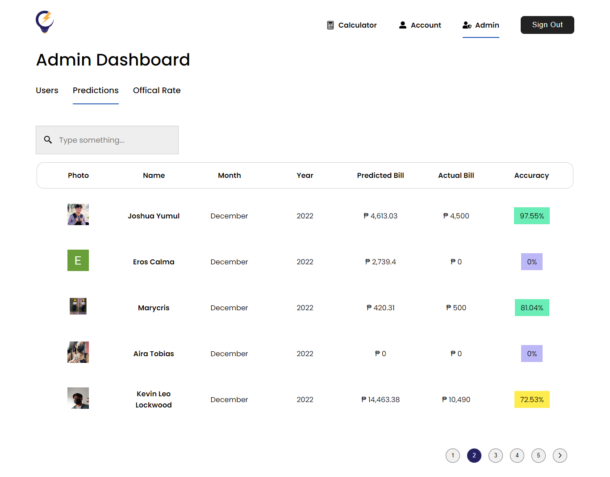

## ⚙ About

This includes two different calculators: basic and advanced.

1. A calculator that is able to predict an approximate/estimate of your upcoming bill by getting the last two recent months with official rates.
2. A calculator that predicts an estimate of your bill according to the number of hours you use your appliance/s daily in a month.

## ✨ Features

-   User Authentication
-   Firebase Storage
-   Rates Prediction
-   Basic User & Admin Roles

## 📸 Screenshots

| :----------------------------------------: | :--------------------------------------------: |
|  |  |
|  |  |
|  |  |

## 🛠 Built With

-   [React.js](https://reactjs.org/) - React makes it painless to create interactive UIs.
-   [Firebase](https://firebase.google.com/) - Firebase is a development platform that provides a multitude of features from hosting to database to analytics to authentication and much more.
-   [SCSS](https://sass-lang.com/) - It is CSS with superpowers. A more advanced and evolved variant of the CSS language.
-   [Python](https://www.python.org/) - Python is an interpreted, object-oriented, high-level programming language with dynamic semantics.
-   [SARIMAX](https://medium.datadriveninvestor.com/time-series-prediction-using-sarimax-a6604f258c56) - Used for time series prediction with python.
-   [Flask](https://flask.palletsprojects.com/en/2.2.x/) - Flask is a micro web framework written in python.

## Installation

1. Clone the repository

```
git clone https://github.com/rvitality/ec-pc.git .
```

2. Install the dependencies

```
cd .\frontend\
npm install
```

3. Run the server. Do note that the server runs on port 3000.

```
npm start
```

## Run backend server

1. Open new terminal
2. Change directory

```
cd .\backend\
```

3. Run flask server

```
flask run
```
