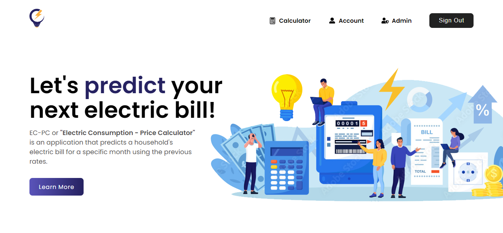

## ⚙ About ⚙

This includes two different calculators: basic and advanced.

1. A calculator that is able to predict an approximate/estimate of your upcoming bill by getting the last two recent months with official rates.
2. A calculator that predicts an estimate of your bill according to the number of hours you use your appliance/s daily in a month.

## Installation

1. Clone the repository.

```
git clone https://github.com/rvitality/ec-pc.git .
```

2. Install the dependencies

```
cd .\frontend\
npm install
```

3. Run the server. Do note that the server runs on port 3000.

```
npm start
```
